# PatchMatch for inpainting

Sample images for [Implention of PatchMatch for image inpainting in cpp](https://github.com/ImageProcessing-ElectronicPublications/patchmatch_inpainting)

## images

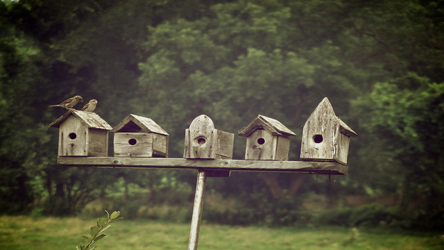

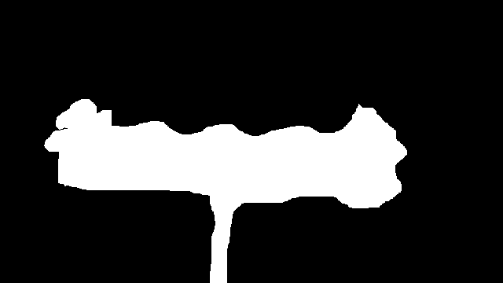

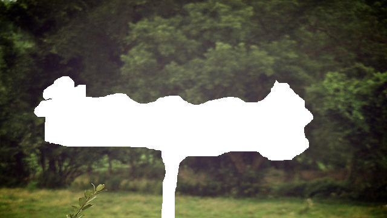

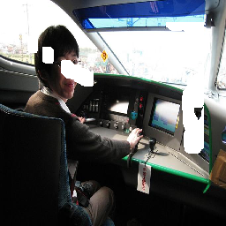

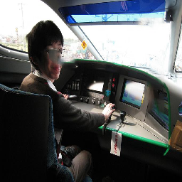

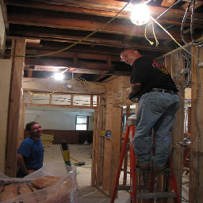

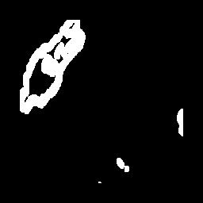

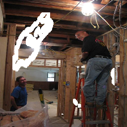

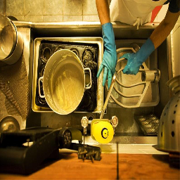

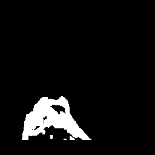

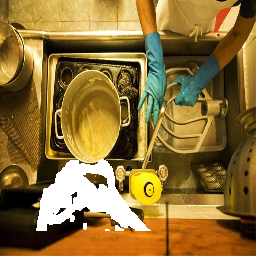

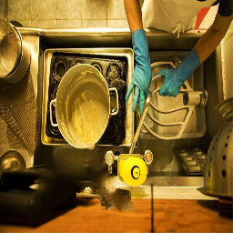

## References

https://github.com/younesse-cv/PatchMatch

